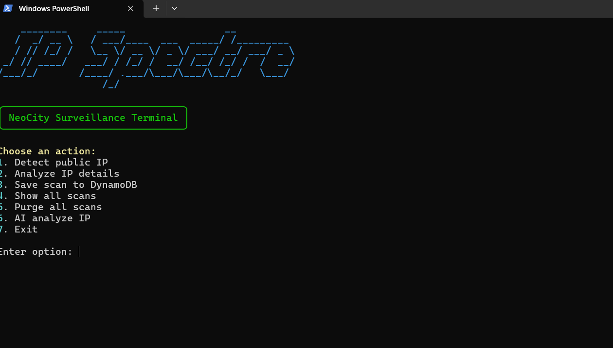

This project is a Python CLI tool that detects the public IP, gathers some basic info about it (country, city, ISP) using external APIs, and stores the results in AWS.

The scans are saved in Amazon DynamoDB, which allows the CLI to keep a history of previous scans.

For the optional part, I also added a small AI integration using OpenRouter that can generate an explanation about the detected IP based on the collected data.

One thing I found interesting while doing this project was discovering AWS Systems Manager Parameter Store, which allows storing the API key securely instead of putting it directly in the code.

